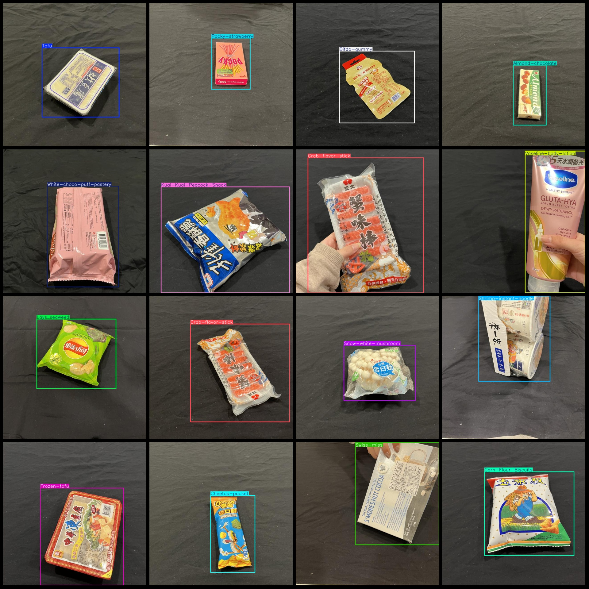
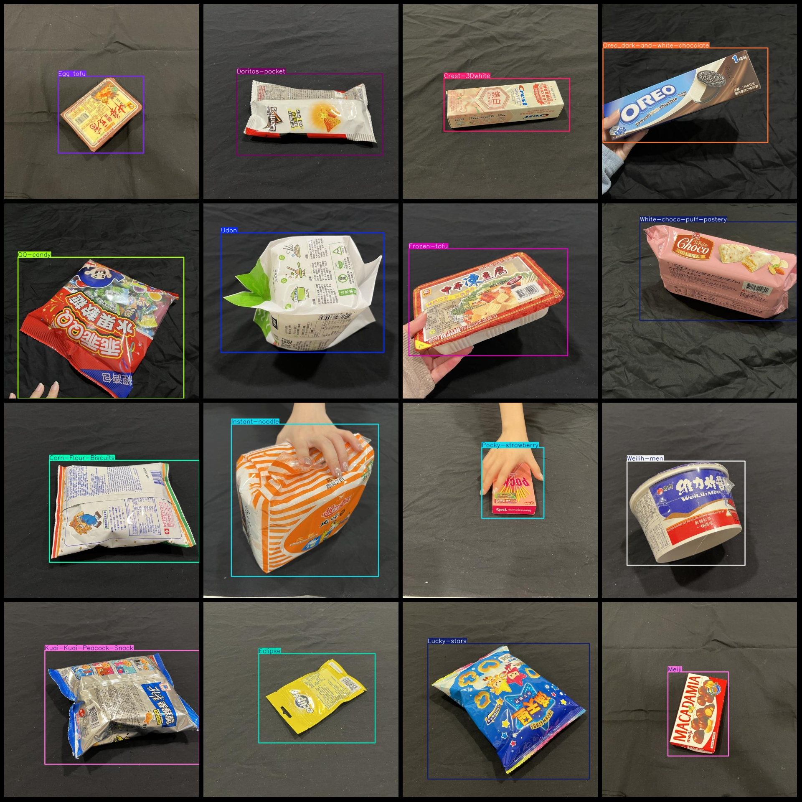

# Food, Beverage, Daily Goods Detection Data Set - VOC + YOLO Format - 1525 Images with 61 Categories

- **File Name**: `dataset.zip`
- ** format**: Pascal VOC+YOLO format
The number of images is 1525.
- **annotation number (XML)**: 1525
- **annotation count (txt)**: 1525
- **annotation class number**: 61
- **annotation class names (Note that the order in YOLO format does not correspond to the order in the labels file)**: [Almond-chocolate, Ansung ramyun, Bifdo-gummy, Canned-food, Chafing-dishlamb-chisp, Cheerful-crackers, Cheetos, Cheetos-pocket, Colgate]
Corn-Flour-Biscuits, Crab-flavor-stick, Crest-3Dwhite, Crispy-rolls_chocolate, Crispy-rolls_milk, Darlie, Doritos, Doritos-pocket, Eclipse, Egg tofu, Egg-roll, Eggs, Frozen-tofu, Fruit-jelly, 
Gummy-chocolate, Hibiscus-tofu, Imei_milk chocolate, Instant-noodle, Kuai-Kuai-Corn-Snack, Kuai-Kuai-Peacock-Snack, Lays_cheese, Lays_original, Lays_seaweed, Lucky-stars, May flower, Meiji, Milk, 
Milk-candy, Milk-puff, Oreo_dark-and-white-chocolate, Pad, Pea crackers, Pocari-sweat, Pocky original, Pocky-strawberry, QQ-candy, Rice-blood-cake, Shin-ramyun, Shrimp strips, Shrimp-instant-noodle, 
Sister-win, Snow-white-mushroom, Soup-base, Strawberry-puff, Swiss-miss, Taiyen-water, Tofu, Toothbrush, Udon, Vaseline-body-lotion, Weilih-men, White-choco-puff-pastery]
## Images

Here is a pay link on Stripe ( https://buy.stripe.com/3cs8yP7sY87d0vu9AB ). Please contact me lonlonago@foxmail.com after funding $89, and I will send you a complete data files , thank you!

